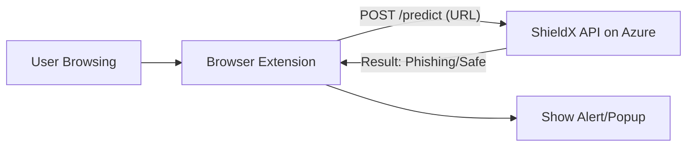

# 🧩 Building a ShieldX Browser Extension

This guide explains how to create a browser extension (Chrome/Edge) that allows users to automatically scan URLs using your hosted ShieldX API.

## 🏗️ Architecture

To make ShieldX accessible to anyone on their system, we split the application into two parts:

1.  **The Server (Backend):** This is your ShieldX API running on Azure (or any cloud). It does the heavy lifting (AI prediction).
2.  **The Client (Extension):** A lightweight browser extension installed on the user's computer. It sends URLs to your Server and displays the result.



## 📂 Extension Structure

A basic extension consists of these files:

-   **`manifest.json`**: The configuration file (permissions, name, version).
-   **`popup.html`**: The small window that appears when you click the extension icon.
-   **`popup.js`**: The logic that runs in the popup (gets current tab URL, calls API).
-   **`icons/`**: Images for the extension icon.

## 🛠️ Step-by-Step Implementation Guide

### 1. Create `manifest.json`
This tells the browser what your extension does.
```json
{
  "manifest_version": 3,
  "name": "ShieldX - AI Security",
  "version": "1.0",
  "permissions": ["activeTab", "scripting"],
  "action": {
    "default_popup": "popup.html",
    "default_icon": "icon.png"
  }
}
```

### 2. Create `popup.html`
A simple UI to show the status.
```html
<!DOCTYPE html>
<html>
<body>
  <h3>ShieldX Scanner</h3>
  <button id="scanBtn">Scan Current Page</button>
  <p id="result"></p>
  <script src="popup.js"></script>
</body>
</html>
```

### 3. Create `popup.js`
The logic to connect to your Azure API.
```javascript
document.getElementById('scanBtn').addEventListener('click', async () => {
  // 1. Get current tab URL
  let [tab] = await chrome.tabs.query({ active: true, currentWindow: true });
  let url = tab.url;

  document.getElementById('result').innerText = "Scanning...";

  // 2. Call your Azure API
  try {
    const response = await fetch('https://YOUR-APP-NAME.azurewebsites.net/predict', {
      method: 'POST',
      headers: { 'Content-Type': 'application/json' },
      body: JSON.stringify({ type: "url", data: url })
    });
    const data = await response.json();
    
    // 3. Show Result
    document.getElementById('result').innerText = `Verdict: ${data.prediction}`;
  } catch (error) {
    document.getElementById('result').innerText = "Error connecting to server.";
  }
});
```

## 📦 Distribution

Once built:
1.  **Pack Extension:** In Chrome/Edge, go to `Extensions > Pack Extension`.
2.  **Distribute:** You get a `.crx` file. Users can drag and drop this into their browser to install it.
3.  **Store:** For public reach, publish it to the Chrome Web Store or Microsoft Edge Add-ons.

## 🤖 Automation
To make it "automated" (scanning without clicking):
-   Use a **Background Script** (`background.js`) that listens for `chrome.tabs.onUpdated`.
-   When a page loads, it automatically sends the URL to the API.
-   If the API returns "Phishing", the extension can block the page or show a red warning banner.
